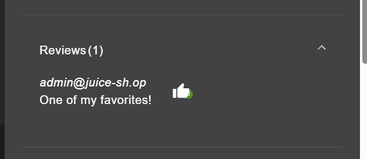
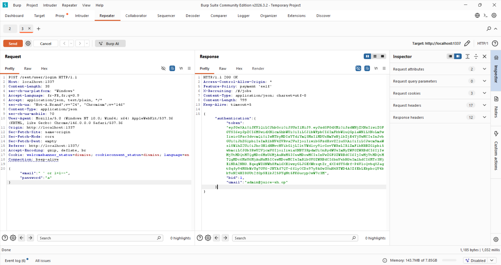
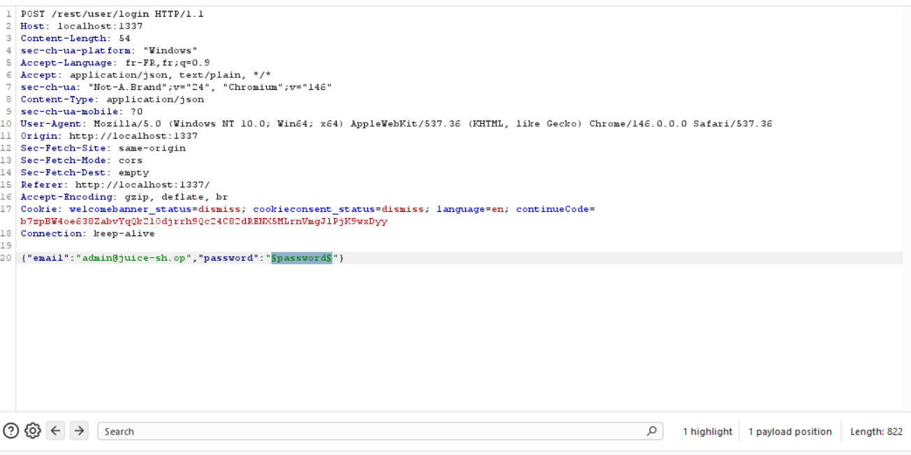
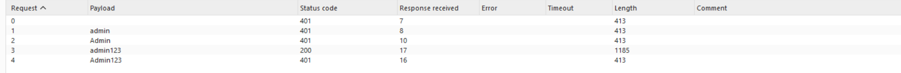
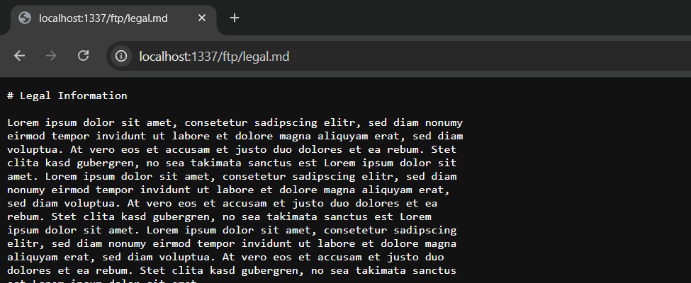
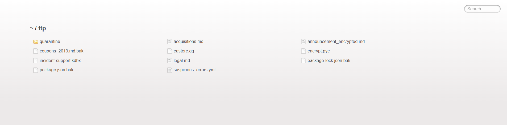
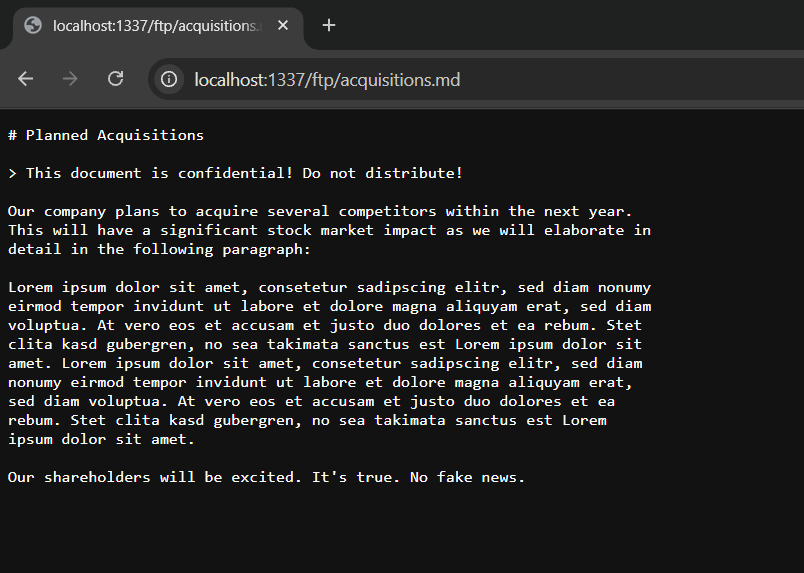
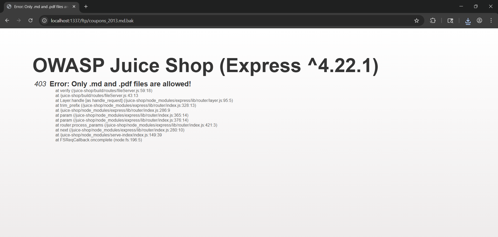
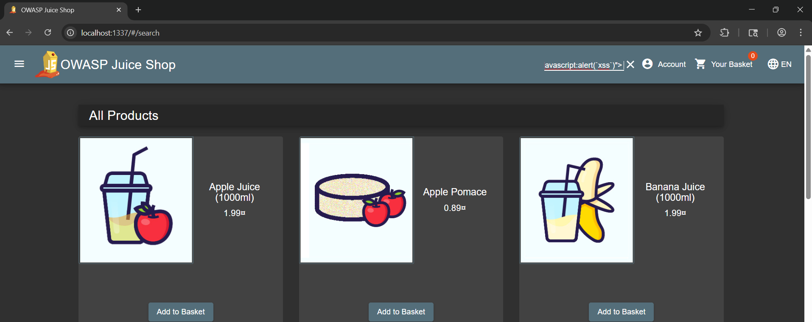
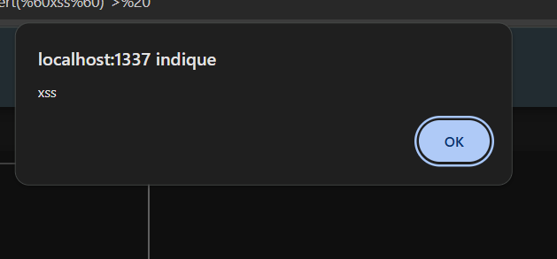

# Liste des vulnérabilités trouvées

---

Juice Shop est une application web intentionnellement vulnérable, conçue pour l'apprentissage de la sécurité informatique. Voici une liste des vulnérabilités identifiées lors de l'analyse de l'application :

## VULN-001 : SQL Injection dans le champ de login

**Sévérité** : Élevée

**Description** : Une injection SQL peut être exploitée via le champ de login pour accéder au compte de n'importe quel utilisateur sans connaître son mot de passe. Il suffit d'entrer une adresse mail valide, visible avec les reviews.

**Procédure** : 

**Impact** :

    - Accès non autorisé au compte administrateur
    - Compromission totale de l'application
    - Exfiltration de données sensibles
    - Potentiel de modification ou suppression de données
    - Utilisation de l'application pour des attaques ultérieures (pivoting)
    - Perte de confiance des utilisateurs et atteinte à la réputation de l'entreprise
    - Responsabilité légale en cas de violation de données personnelles

**Recommandations** :

    - Utiliser des requêtes préparées (prepared statements) pour toutes les interactions avec la base de données
    - Valider et assainir toutes les entrées utilisateur
    - Mettre en place une politique de gestion des erreurs qui ne divulgue pas d'informations sensibles
    - Effectuer des tests de sécurité réguliers pour identifier et corriger les vulnérabilités

## VULN-002 : Brute Force sur le champ de login

**Sévérité** : Élevée

**Description** : Le champ de login est vulnérable à une attaque de force brute, permettant à un attaquant de tenter de nombreuses combinaisons de mots de passe sans restriction.

**Procédure** : En utilisant un outil de brute force (comme Hydra ou Burp Suite), un attaquant peut automatiser les tentatives de connexion en essayant différentes combinaisons de mots de passe pour un compte utilisateur ou administrateur.

**Procédure** :

**Impact** :

    - Accès non autorisé à des comptes utilisateurs ou administrateurs
    - Compromission de l'application et des données sensibles
    - Potentiel de modification ou suppression de données
    - Utilisation de l'application pour des attaques ultérieures (pivoting)
    - Perte de confiance des utilisateurs et atteinte à la réputation de l'entreprise
    - Responsabilité légale en cas de violation de données personnelles

**Recommandations** :

    - Mettre en place une politique de verrouillage de compte après un certain nombre de tentatives de connexion échouées
    - Utiliser des CAPTCHA pour empêcher les attaques automatisées
    - Implémenter une authentification à deux facteurs (2FA) pour renforcer la sécurité des comptes
    - Surveiller les tentatives de connexion et alerter en cas d'activité suspecte
    - Forcer l'utilisation de mots de passe forts et uniques pour tous les comptes utilisateurs et administrateurs

## VULN-003 : Exposition de documents sensibles

**Sévérité** : Moyenne

**Description** : Des documents sensibles, tels que les conditions générales de vente (CGV), sont accessibles sans authentification, ce qui peut entraîner la divulgation d'informations confidentielles.

**Procédure** : En accédant à l'URL spécifique des CGV, un utilisateur non authentifié peut visualiser et télécharger ces documents.

**Procédure** :

**Impact** :

    - Divulgation d'informations confidentielles
    - Potentiel de violation de la vie privée des utilisateurs
    - Atteinte à la réputation de l'entreprise
    - Responsabilité légale en cas de violation de données personnelles

**Recommandations** :

    - Restreindre l'accès aux documents sensibles en exigeant une authentification
    - Mettre en place des contrôles d'accès basés sur les rôles pour limiter l'accès aux informations sensibles
    - Assurer la sécurité des documents en les stockant dans un emplacement sécurisé et en utilisant des permissions appropriées
    - Effectuer des audits réguliers pour identifier et corriger les vulnérabilités d'exposition de données

## VULN-004 : Poison Null Byte dans le dossier des fichiers

**Sévérité** : Élevée

**Description** : Le poison null byte est une technique d'attaque qui exploite la manière dont les applications traitent les chaînes de caractères. En insérant un caractère null (0x00) dans une requête, un attaquant peut contourner les contrôles de sécurité et accéder à des fichiers sensibles. Ce qui permet de contourner les restrictions d'accès et de visualiser des fichiers qui devraient être protégés.

**Procédure** :

**Impact** :

    - Accès non autorisé à des fichiers sensibles
    - Compromission de l'application et des données sensibles
    - Potentiel de modification ou suppression de données
    - Utilisation de l'application pour des attaques ultérieures (pivoting)
    - Perte de confiance des utilisateurs et atteinte à la réputation de l'entreprise
    - Responsabilité légale en cas de violation de données personnelles

**Recommandations** :

    - Valider et assainir toutes les entrées utilisateur pour empêcher l'injection de caractères spéciaux
    - Mettre en place des contrôles d'accès stricts pour protéger les fichiers sensibles
    - Utiliser des bibliothèques de sécurité pour gérer les fichiers et les chemins d'accès de manière sécurisée
    - Effectuer des tests de sécurité réguliers pour identifier et corriger les vulnérabilités d'injection de caractères spéciaux

## VULN-005 : Stored XSS dans la barre de recherche

**Sévérité** : Élevée

**Description** : Une vulnérabilité de type Cross-Site Scripting (XSS) stocké a été identifiée dans la barre de recherche de l'application. Un attaquant peut injecter du code JavaScript malveillant qui sera stocké et exécuté chaque fois que la page contenant la barre de recherche est visitée. C'est à dire au démarrage de l'application, ou à chaque fois que l'utilisateur navigue vers la page d'accueil.

**Procédure** :

**Impact** :

    - Exécution de code malveillant dans le navigateur des utilisateurs
    - Vol de cookies de session et d'informations d'identification
    - Compromission de comptes utilisateurs
    - Potentiel de modification ou suppression de données
    - Utilisation de l'application pour des attaques ultérieures (pivoting)

**Recommandations** :

    - Valider et assainir toutes les entrées utilisateur pour empêcher l'injection de code malveillant
    - Utiliser des bibliothèques de sécurité pour gérer les entrées utilisateur de manière sécurisée
    - Mettre en place une politique de gestion des erreurs qui ne divulgue pas d'informations sensibles
    - Effectuer des tests de sécurité réguliers pour identifier et corriger les vulnérabilités XSS
